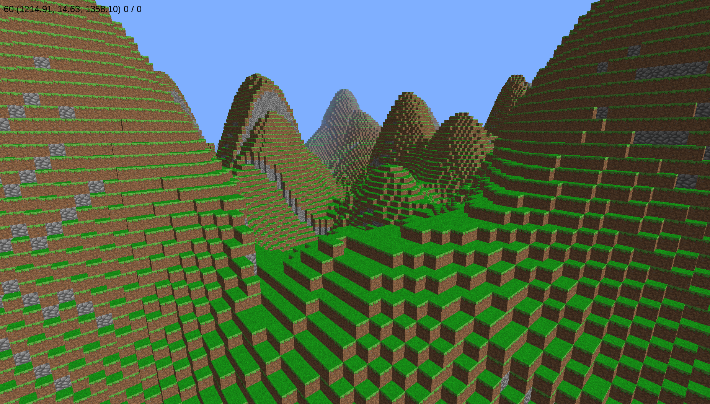

**This repo is discontinued.** Development continues at (https://github.com/spillz/minepy2).

minepy
=======

A fork of fogleman's simple Minecraft-inspired demo (https://github.com/fogleman/minecraft) written in 
Python.

Limitations of the Master Branch
--------------------------------

1. When moving around you will see framerate drops because terrain generation slows down the drawing speed 
   due to python's Global Interpreter Lock. Check out the server branch, which works around this problem by 
   using a background process instead of a thread. 
2. Lighting is very simple, no shadows or dark areas of the terrain yet. The server branch has some basic 
   lighting implemented but it is far from compelete and doesn't propagate across sectors.
3. Nothing is saved. The server branch uses a level DB database to store world changes.

Technical
---------

Uses pyglet to render the graphics and numpy for its powerful and fast array processing. 

Has much better performance than fogleman's original version and world size is virtually unlimited.

Currently uses minecraft style textures and you can easily add new block types. Take a look at blocks.py

Take a look at config.py for some configuration options, such as draw distance. 

How to Run
==========

To get the required dependencies and sources::

    pip install pyglet
    pip install numpy
    git clone https://github.com/spillz/minepy.git
    cd minepy
    python main.py

Alternatively, to try the server branch you will need to get leveldb and checkout the server branch::

    pip install leveldb
    git checkout server

You can run it standalone::
    
    python main.py
    
Or try a server with one or more clients::

   python server
   
To get 2 clients running on the same machine, open a new terminal and type::

   python main.py localhost &
   python main.py localhost &

You can also connect from elsewhere on your LAN if you know the local 
IP of the PC running the server, i.e. you would run ::

   python main.py <IPADDRESS>

Mac
----

On Mac OS X, you may have an issue with running Pyglet in 64-bit mode. Try running Python in 32-bit mode first::

    arch -i386 python main.py

If that doesn't work, set Python to run in 32-bit mode by default::

    defaults write com.apple.versioner.python Prefer-32-Bit -bool yes

This assumes you are using the OS X default Python.  Works on Lion 10.7 with the default Python 2.7, and may work on other versions too.  Please raise an issue if not.

Or try Pyglet 1.2 alpha, which supports 64-bit mode::

    pip install https://pyglet.googlecode.com/files/pyglet-1.2alpha1.tar.gz

If you don't have pip or git
--------------------------------

For pip:

- Mac or Linux: install with `sudo easy_install pip` (Mac or Linux) - or (Linux) find a package called something like 'python-pip' in your package manager.
- Windows: [install Distribute then Pip](http://stackoverflow.com/a/12476379/992887) using the linked .MSI installers.

For git:

- Mac: install [Homebrew](http://mxcl.github.com/homebrew/) first, then `brew install git`.
- Windows or Linux: see [Installing Git](http://git-scm.com/book/en/Getting-Started-Installing-Git) from the _Pro Git_ book.

See the [wiki](https://github.com/fogleman/Minecraft/wiki) for this project to install Python, and other tips.

How to Play
================

Moving

- W: forward
- S: back
- A: strafe left
- D: strafe right
- Mouse: look around
- Space: jump
- Tab: toggle flying mode

Building

Use the number keys to select the type of block to create:
    - 1: dirt with grass
    - 2: grass
    - 3: sand
    - etc
- Mouse left-click: remove block
- Mouse right-click: create block

Quitting

- ESC: release mouse, then close window

Licenses
========

Code 

Copyright (C) 2014 by Damien Moore and licensed GPLv3

    This program is free software: you can redistribute it and/or modify
    it under the terms of the GNU General Public License as published by
    the Free Software Foundation, either version 3 of the License, or
    (at your option) any later version.

    This program is distributed in the hope that it will be useful,
    but WITHOUT ANY WARRANTY; without even the implied warranty of
    MERCHANTABILITY or FITNESS FOR A PARTICULAR PURPOSE.  See the
    GNU General Public License for more details.

    You should have received a copy of the GNU General Public License
    along with this program.  If not, see <http://www.gnu.org/licenses/>.

Original Sources Copyright (C) 2013 Michael Fogleman

    Permission is hereby granted, free of charge, to any person obtaining
    a copy of this software and associated documentation files (the "Software"), 
    to deal in the Software without restriction, including without limitation 
    the rights to use, copy, modify, merge, publish, distribute, sublicense, 
    and/or sell copies of the Software, and to permit persons to whom the
    Software is furnished to do so, subject to the following conditions:

    The above copyright notice and this permission notice shall be included 
    in all copies or substantial portions of the Software.

    THE SOFTWARE IS PROVIDED "AS IS", WITHOUT WARRANTY OF ANY KIND, EXPRESS OR 
    IMPLIED, INCLUDING BUT NOT LIMITED TO THE WARRANTIES OF MERCHANTABILITY, 
    FITNESS FOR A PARTICULAR PURPOSE AND NONINFRINGEMENT. IN NO EVENT SHALL THE
    AUTHORS OR COPYRIGHT HOLDERS BE LIABLE FOR ANY CLAIM, DAMAGES OR OTHER LIABILITY, 
    WHETHER IN AN ACTION OF CONTRACT, TORT OR OTHERWISE, ARISING FROM, OUT OF OR IN 
    CONNECTION WITH THE SOFTWARE OR THE USE OR OTHER DEALINGS IN THE SOFTWARE.

Texture Pack - Faithful Venom v1.5

    Faith Venom is licensed CC BY-NC-SA 3.0
    http://minecraft.curseforge.com/texture-packs/51244-faithfulvenom-32x-32x
